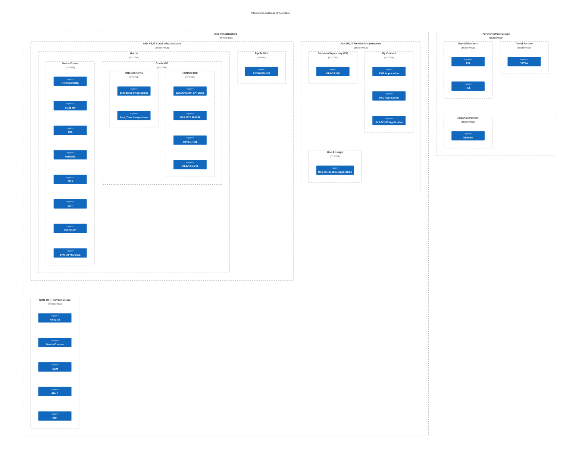

# Axis Bank

# Modules

#RECRUITMENT #CORE-HR #OTL #PMS #EXIT #DAC #PAYROLL

# Integration Landscape

```mermaid
C4Context 
  title Integration Landscape Of Axis Bank
  Enterprise_Boundary(E0,"Axis Infrastructure") {
  Enterprise_Boundary(E0_E0, "Axis HR_IT Cloud Infrastructure") {
	System_Boundary(E0_E0_SB0, "Oracle") {
	  System_Boundary(E0_E0_SB0_SB0, "Oracle Fusion") {
	  
		System(E0_E0_SB0_SB0_S0, "ONBOARDING")
		System(E0_E0_SB0_SB0_S1, "CORE HR")
		System(E0_E0_SB0_SB0_S2, "OTL")
		System(E0_E0_SB0_SB0_S3, "PAYROLL")
		System(E0_E0_SB0_SB0_S4, "PMS")
		System(E0_E0_SB0_SB0_S5, "EXIT")

		System(E0_E0_SB0_SB0_S6, "CHECKLIST")
		System(E0_E0_SB0_SB0_S7, "BPM_APPROVALS")
	  }
	  System_Boundary(E0_E0_SB0_SB1, "Oracle OIC") {
	  	System_Boundary(G0,"INTEGRATIONS")
{
		System(G0_S0, "Scheduled Integrations")
		System(G0_S1, "Real_Time Integrations")
		}
	System_Boundary(G1,"CONNECTOR")
	{
	  	System(G1_S0, "SAKSHAM API GATEWAY")
  		System(G1_S1, "S2FS SFTP SERVER")
  		System(G1_S2, "RIPPLE-HIRE")
  		System(G1_S3, "ORACLE-HCM")
  }
  
	  }
	}
	  System_Boundary(E0_E0_SB0_SB2, "Ripple Hire") {
  		System(E0_E0_SB0_SB2_S1, "RECRUITMENT")
  }

  }
  
    Enterprise_Boundary(E0_E1, "Axis HR_IT Premise Infrastructure") {
	  System_Boundary(E0_E1_E0_SB0, "Common Repository (CR)") {
  		System(E0_E1_E0_SB0_S0, "ORACLE DB")
  }
  	  System_Boundary(E0_E1_E0_SB1, "My Connect") {
  		System(E0_E1_E0_SB1_S0, "EXIT Application")
  		System(E0_E1_E0_SB1_S1, "DAC Application")
  		System(E0_E1_E0_SB1_S2, "LMS GCUBE Application")
  }
    	  System_Boundary(E0_E1_E0_SB2, "One Axis App") {
  		System(E0_E1_E0_SB2_S0, "One Axis Mobile Application")
  }
  }

	Enterprise_Boundary(E0_E2,"NON_HR_IT Infrastructure"){
	  		System(E0_E2_S0, "Finnacle")
	  		System(E0_E2_S1, "Oracle Finance")
	  		System(E0_E2_S2, "IDAM")
	  		System(E0_E2_S3, "AD-ID")
	  		System(E0_E2_S4, "ABR")
}
}


Enterprise_Boundary(E1,"Partner Infrastructure") {
  Enterprise_Boundary(E1_E0, "Payroll Partners") {
    		System(E1_E0_S0, "TSR")
    		System(E1_E0_S1, "HGS")
}
  Enterprise_Boundary(E1_E1, "Travel Partner") {
    		System(E1_E1_S0, "YATRA")
}
  Enterprise_Boundary(E1_E2, "Analytics Partner") {
    		System(E1_E2_S0, "Infeedo")
}
}
```

# Report

# Integrations

# Conversions

# Enhancements

# Forms

# Workflow

